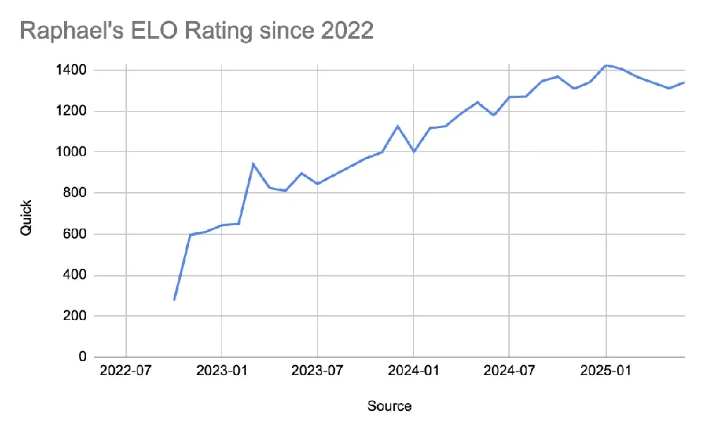
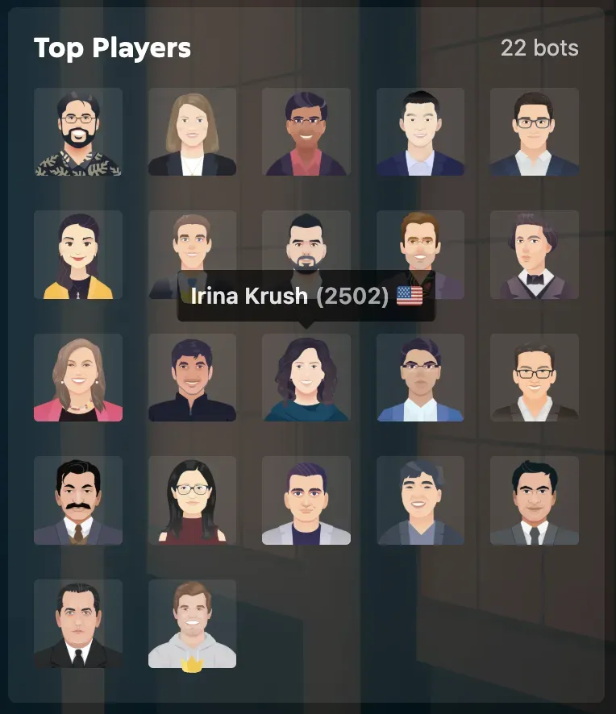

My 9-year-old son has a 1400 ELO rating, and my 7-year-old daughter has a 900 ELO rating. Both started playing at age 5 and have progressed significantly—though their ratings have become intertwined with their identities.

Here are four lessons from this journey.

## Lesson 1: Compare Yourself to Yesterday's Self

Rather than measuring progress against other chess families, everyone plays a different game. You can only compare yourself with who you were yesterday because we are all playing a different game.

Comparing oneself to others breeds discouragement and confidence loss, yet these feelings signal when adjustments are needed.

## Lesson 2: Sometimes You Win, Sometimes You Learn

At the highest competitive levels, even Grand Masters lose roughly 49% of their games. Losing is an opportunity to learn—whether in chess or professional settings where projects fail and pivots occur.

## Lesson 3: Understand Compounding Interests

Meeting chess champion Irina Krush reinforced that sustained commitment yields long-term benefits. Those at the highest professional ranks typically remained in their field longest.

## Lesson 4: Enjoy the Game

Rather than emphasizing winning outcomes, my wife and I now encourage our children to focus on enjoying chess itself. Have fun and enjoy the game! Don't worry about winning or losing.
