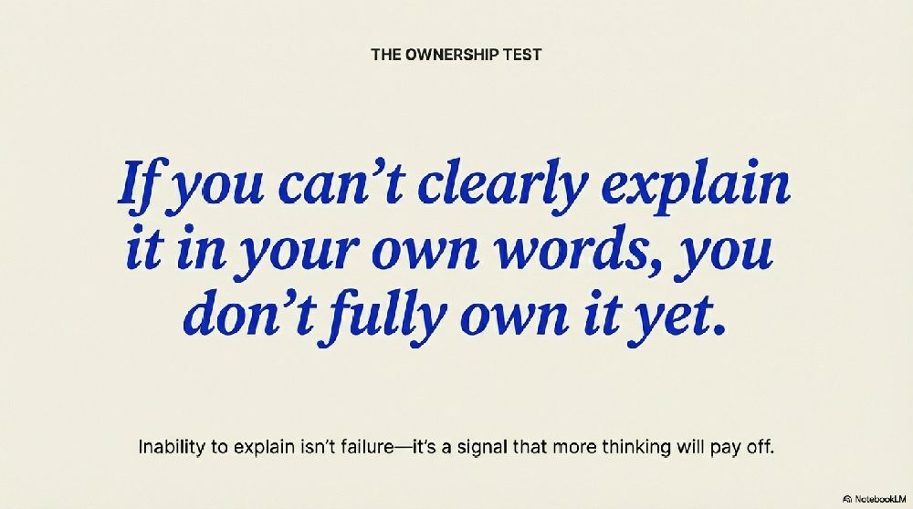

# We’re Using AI More — and That’s the Wrong Thing to Optimize

AI is becoming part of how we build software. It helps us write code faster, explore ideas more quickly, and try things we wouldn’t have attempted before. That’s real progress. But using AI more is not the same as doing better work.

Optimizing for AI usage is the wrong metric. It’s like optimizing for typing more lines of code. Tools are not the goal. Better judgment, clearer decisions, and higher-quality outcomes are.

Things are also moving very fast. New models, new workflows, new expectations. It’s easy to feel like you’re falling behind if you don’t keep up. When expectations are unclear, we default to what’s visible: speed. More output. Faster iteration. That pressure is real, and it’s understandable.

The risk is subtle. Efficiency quietly becomes shorthand for speed, and speed becomes a way to outsource thinking.

## A Better Mental Model: AI as a Coach for Your Thinking

A more useful way to think about AI is as a coach, not a shortcut. A good coach doesn’t do the work for you. They ask questions, challenge assumptions, and push you to explain your reasoning.

Used well, AI does the same. It helps you see blind spots, test ideas, and sharpen your judgment. The responsibility stays with you. You still need to understand what you’re building and why it works.

This applies to code just as much as anything else. AI is powerful when it helps you reason about tradeoffs, edge cases, system behavior, and failure modes—not just when it generates code quickly.

## Quality First, Speed as a Side Effect

Strong judgment should come first. When quality is high, speed often follows as a side effect. When speed comes at the cost of clarity and rigor, it’s worth questioning.

A simple test applies to any AI-assisted work: if you can’t clearly explain it in your own words, you don’t fully own it yet. That’s not failure—it’s a signal that more thinking will pay off.

The question I keep coming back to is simple: is AI helping me think better, or just faster? If we optimize for better thinking instead of visible AI usage, the efficiency we care about will follow.

# Core idea I want to carry forward

What I ultimately care about is clarity of thinking.

Clear thinking means being able to articulate what you’re concerned about, why it matters, and what tradeoffs you’re making. When thinking is unclear, everything downstream suffers—code quality, decisions, communication, and execution. When thinking is clear, the rest becomes easier.

For me, AI—especially GPT-5—has been most valuable as a way to reach that clarity over the past few weeks. Not by giving answers, but by helping structure thoughts, surface assumptions, and force articulation. Other models can generate output, but they’re less effective at sharpening reasoning itself.

Once clarity of thinking is achieved, speed, efficiency, and execution tend to follow naturally. Clarity is the real leverage point.

> **2/1/26 Update:** Oh, how wrong I was. The best model so far is Claude Opus 4.5. What a difference!

